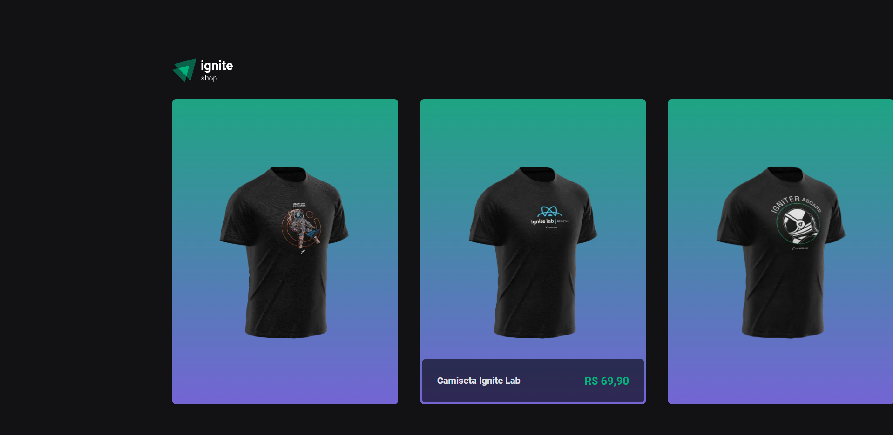
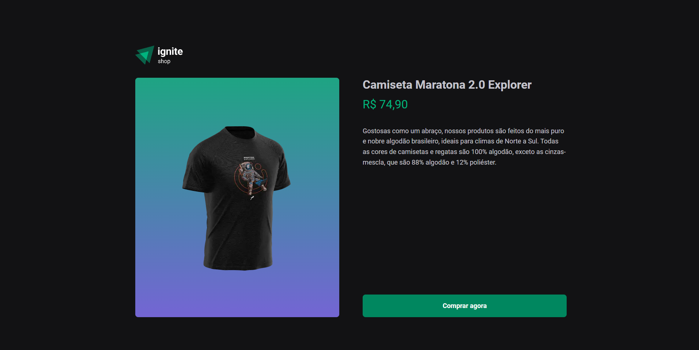
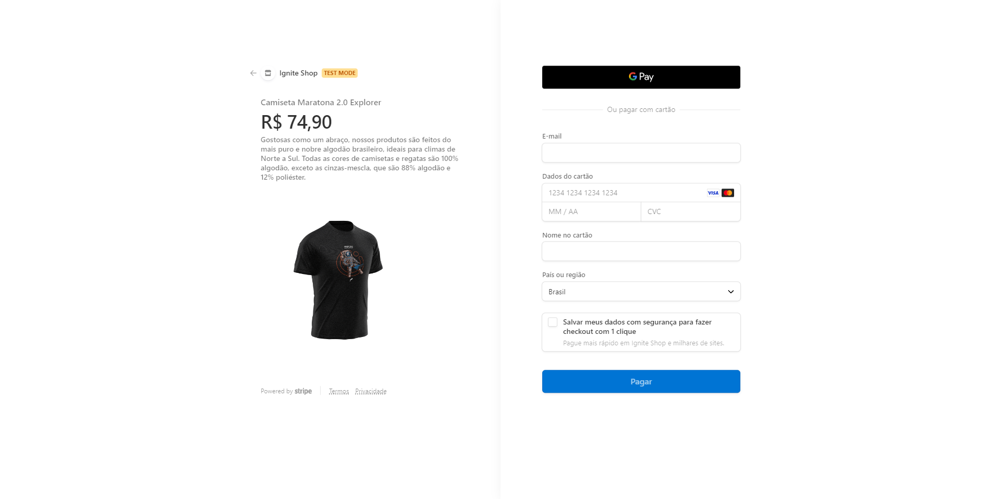
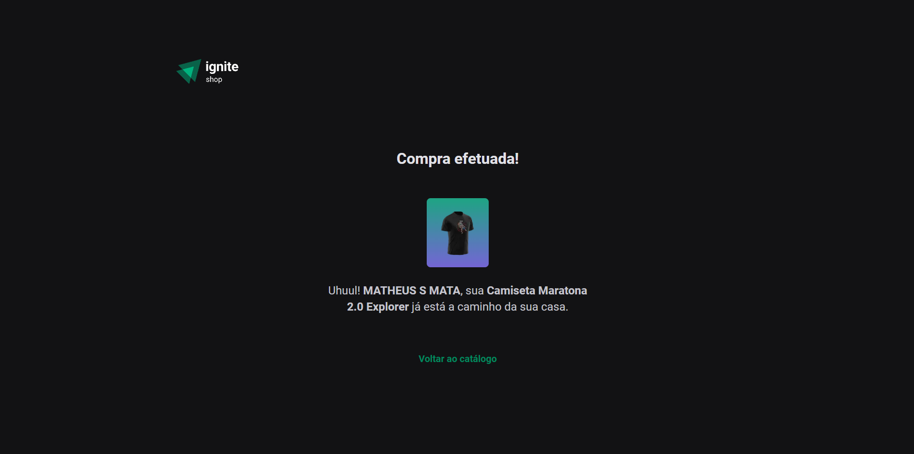

# Ignite Shop

Projeto em Next JS.

### Objetivo
Realizar o desenvolvimento de um e-commerce com api de pagamentos (stripe) e com página de sucesso apresentando todos os items comprados!

## Status: Desafio em desenvolvimento.

### Extra Desafio

Nesse desafio, você vai aproveitar a aplicação que já desenvolvemos na trilha para implementar um carrinho que utilizará os dados da API do Stripe para buscar os itens existentes, e controlará, através da sua aplicação, o número de itens que a pessoa deseja comprar.

- Você utilizará a listagem já criada pela aplicação, mas adicionará a possibilidade de adicionar aquele item ao carrinho na página do produto.
- Salvar todos os itens selecionados em sua aplicação, e exibir o número de itens no carrinho
- Enviar o carrinho que você armazenou na aplicação para a rota de checkout, onde irá gerar a sessão de checkout com os ``line_items`` necessários.

Para completar esse desafio você vai  precisar de realizar algumas pesquisas para entender sobre a API do Stripe.

### Imagens

### Pré-requisitos
Antes de começar, você vai precisar ter instalado em sua máquina as seguintes ferramentas: Git, Node.js. Além disto é bom ter um editor para trabalhar com o código como VSCode

### Instalação
- `npm i`

### Rodando a aplicação
- `npm run dev`
